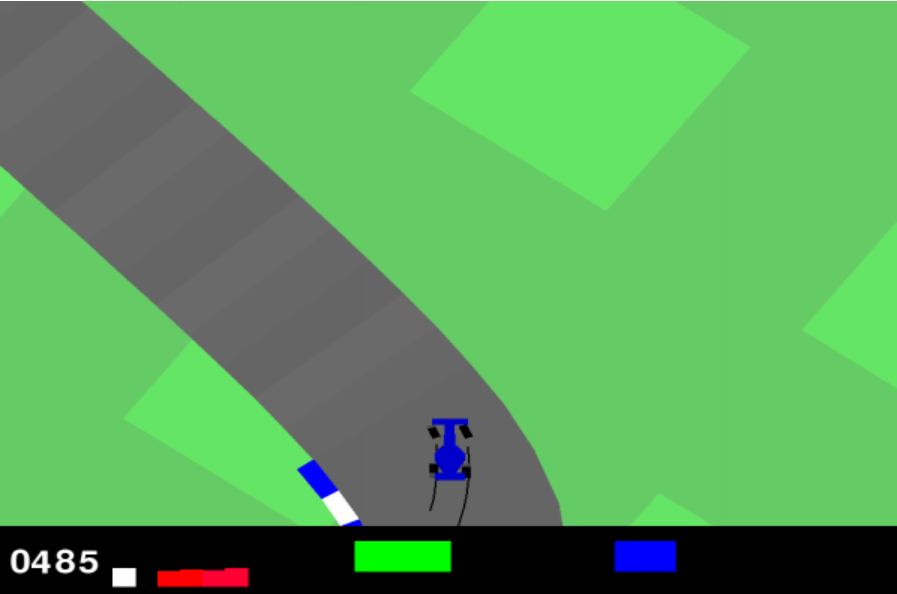

# RL-Autonomous-Driving
Reinforcement Learning Project for making a car drive autonomously in a race track with the help of a game

PPO algorithm is used for this project. 
There are two saved models in this repository. One with 100k timesteps and one with 500k timesteps. These both can be compared, but more the timesteps, the better will be the model. 

100K Timesteps Learning gave a reward mean of 195.9183713644743 and a standard deviation of 0.0 

## Image with the Racecar Game

    

## Try the game
You can also try the game in module 6 of the notebook
